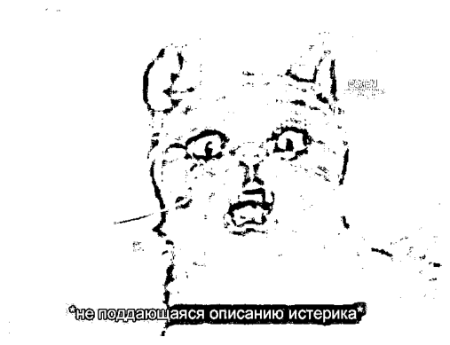

# Лабораторная работа №1: Бинаризация с адаптивным порогом
### Задание:
Бинаризация с адаптивным порогом. На вход поступает изображение,
программа отрисовывает окно, в которое выводится либо исходное
изображение после преобразования в черно-белое, либо после
бинаризации (переключение по нажатию клавиши).

Алгоритм нужно реализовать в 3 вариантах: с использованием сторонних библиотек на
Python, с помощью примитивных операций и циклов на Python (можно
использовать NumPy массивы) и с помощью компилируемого кода (на C++
либо с использованием, например, Numba на Python).

## 1. Теоретическая база
Бинаризация изображений — процесс преобразования серых оттенков изображения в черно-белое изображение (пиксели принимают только два значения: 0 или 255). Адаптивная бинаризация отличается тем, что порог для каждого пикселя определяется на основе определенной области вокруг него, что позволяет более точно обработать изображения с неоднородной освещенностью.

Основные методы бинаризации:

* Глобальная бинаризация -- использует один порог для всего изображения.
* Адаптивная бинаризация -- порог зависит от области изображения вокруг пикселя.

## 2. Описание разработанной системы
В ходе лабораторной работы была разработана программа для преобразования входных данных с камеры в черно-белое изображение, а также бинаризации изображений с адаптивным порогом. Каждый из методов написан в трех вариантах:

* С использованием сторонних библиотек на Python.
* С помощью примитивных операций и циклов на Python.
* С использованием компилируемого кода (Numba на Python).

Для запуска программы выполняется команда `python image_binarization.py`. Программа считывает потоковые изображения с камеры. Для переключения из черно-белого / бинаризации используется клавиша *Space*. Для переключения между реализациями *1* - cv2, *2* - py, *3* - numba. Выход по клавише *q*.

### Алгоритмы и принципы работы
#### C использованием сторонних библиотек

Для этого была применена библиотека OpenCV для загрузки изображения, его преобразования в черно-белое и выполнения адаптивной бинаризации. Использовалась функция adaptiveThreshold с параметрами `ADAPTIVE_THRESH_MEAN_C` (порог вычисляется как разница между средним значением всех пикселей в выбранном блоке и константой `C`), `THRESH_BINARY` (пиксели, значения которых выше порога, устанавливаются в максимальное значение 255, остальные устанавливаются в 0). Константа `C` по дефолту равна 10.

```
def adaptive_binarization_cv2(image, block_size=21, C=10):
    gray_image = cv2.cvtColor(image, cv2.COLOR_BGR2GRAY)
    binary_image = cv2.adaptiveThreshold(gray_image, 255, cv2.ADAPTIVE_THRESH_MEAN_C, cv2.THRESH_BINARY, block_size, C)
    return binary_image
```

Для простого преобразования в черно-белое изображение была использована функция `cvtColor` с параметром `COLOR_BGR2GRAY`.
```
def to_black_white_cv2(image):
    gray_image = cv2.cvtColor(image, cv2.COLOR_BGR2GRAY)
    return gray_image
```
#### С использованием примитивных операций и циклов:

Для реализация алгоритма адаптивной бинаризации был использован принцип скользящего окна для определения порога. Пороговое значение определяется для каждого пикселя на основе среднего значения интенсивностей пикселей в его окрестности.

Происходит преебор всех пикселей изображения. Для каждого пикселя вычисляется блок заданного размера (block_size) и рассчитывается среднее значение пикселей в этом блоке. Если значение текущего пикселя больше, чем среднее значение блока минус константа C, пиксель в бинарном изображении устанавливается в 255 (белый).
В противном случае, пиксель устанавливается в 0 (черный).
```
def adaptive_binarization_py(image, block_size=21, C=10):
    gray_image = to_black_white_py(image)
    height, width = gray_image.shape
    binary_image = np.zeros((height, width), dtype=np.uint8)
    half_block = block_size // 2

    for i in range(height):
        for j in range(width):
            y1 = max(0, i - half_block)
            y2 = min(height, i + half_block + 1)
            x1 = max(0, j - half_block)
            x2 = min(width, j + half_block + 1)
            
            block = gray_image[y1:y2, x1:x2]
            mean = np.mean(block)
            
            if gray_image[i, j] > mean - C:
                binary_image[i, j] = 255
            else:
                binary_image[i, j] = 0

    return binary_image
```

Для реализации обычного преобразования в черно-белое изображение была использована функция ниже. Функция для преобразования `BW = 0.2989 * R + 0.587 * G + 0.114 * B`. Считается, что вычисленный таким образом цвет лучше всего подходит для человеческого глаза, поскольку яркость каждой компоненты глаз воспринимает по-разному.
```
def to_black_white_py(image):
    return np.dot(image[...,:3], [0.2989, 0.587, 0.114]).astype(np.uint8)
```

#### С использованием компилируемого кода (Numba):

Была применена JIT-компиляции для ускорения выполнения алгоритма адаптивной бинаризации. Чтобы упростить код здесь на вход приходит уже преобразованное изображение в серых оттенках, чтобы избежать вызов функции.
```
@jit
def adaptive_binarization_jit(image, block_size=20, C=10):
    height, width = image.shape
    
    binary_image = np.zeros((height, width), dtype='uint8')
    
    half_block = block_size // 2
    
    
    for i in range(height):
        for j in range(width):
            y1 = max(0, i - half_block)
            y2 = min(height, i + half_block + 1)
            x1 = max(0, j - half_block)
            x2 = min(width, j + half_block + 1)
            
            block = image[y1:y2, x1:x2]
            
            mean = np.mean(block)
            
            if image[i, j] > mean - C:
                binary_image[i, j] = 255
            else:
                binary_image[i, j] = 0
    
    return binary_image
```

Для конвертации в изображение в черно-белое.
```
@jit
def to_black_white_jit(image):
    x, y, _ = image.shape
    arr = np.zeros((x, y), dtype=np.uint8)
    
    for i in range(x):
        for j in range(y):
            r = image[i, j, 0]
            g = image[i, j, 1]
            b = image[i, j, 2]
            gray = 0.2989 * r + 0.587 * g + 0.114 * b
            arr[i, j] = int(gray)
    
    return arr
```

## 3. Результаты работы и тестирования системы
В ходе тестирования системы были получены следующие результаты (эксперименты в файле lab1.ipynb).

Результаты для определения порога вручную c `threshold=127` и `55`:


Результаты времени работы функций (на локальной машине):

|          Time, s        |  OpenCV  |  Python  |  Numba  |
|-------------------------|----------|----------|---------|
|**Adaptive binarization**|  0.01689 |  9.46519 | 0.46056 |
|     **Black-white**     |  0.01627 |  0.01838 | 0.00199 |

Как можно заметить, время выполнения с использованием numba значительно уменьшилось (в 20 и 10 раз соответственно) по сравнению с нативной реализацией на Python. При потоковых данных использовать реализацию без оптимизации довольно затруднительно. Однако при использовании библиотеки OpenCV бинаризация осуществляется по-прежнему быстрее.

С адаптивной бинаризацией картинка получается следующей:


## 4. Выводы по работе
На примере разработанной программы для адаптивной бинаризации изображений продемонстрировала эффективность и разницу в производительности между различными подходами. Использование библиотек позволяет быстро получать результаты, но понимание и реализация алгоритма вручную полезны для глубокого понимания процесса. Применение Numba позволяет улучшить производительность кода и уменьшить время его выполнения.

## 5. Использованные источники
1. OpenCV Documentation: https://docs.opencv.org
2. Numba Documentation: https://numba.pydata.org/
3. Статья "Бинаризация изображений: алгоритм Брэдли": https://habr.com/ru/articles/278435/
4. Статья про цветовые пространства и бинаризацию: https://robx.org/wiki/prog/opencv-biblioteka/cvet_opencv/