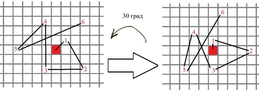
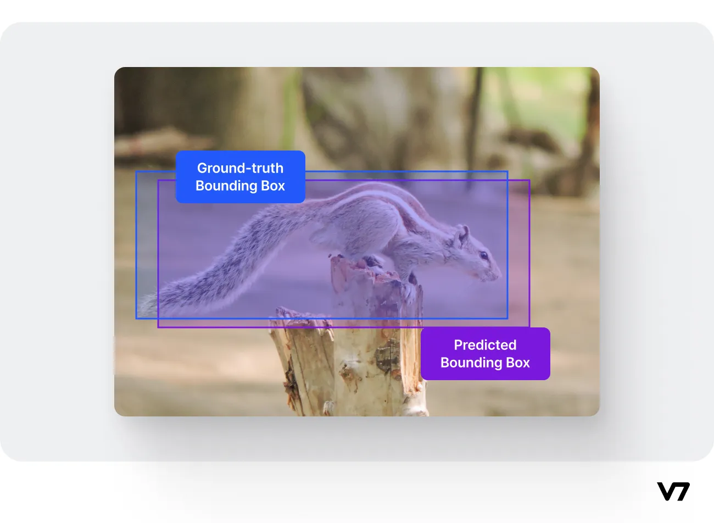
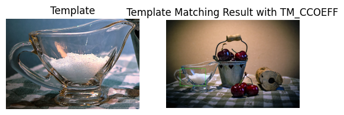
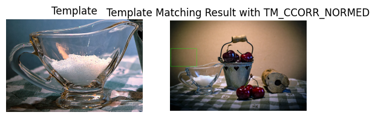

# Лабораторная работа №2: Детектирование объектов на изображении
### Задание:
Необходимо реализовать два примитивных детектора объектов на
изображении, работающих с помощью поиска эталона на входном
изображении.

1. Прямой поиск одного изображения на другом (template matching)
2. Поиск ключевых точек эталона на входном изображении (например, с
помощью SIFT, ORB..)

Программа должна принимать на вход два изображения, эталон и то, на
котором будет производиться поиск. На выходе программа должна строить
рамку в виде четырехугольника в области, где с наибольшей вероятностью
находится искомый объект. Необходимо протестировать оба варианта
программы на разных изображениях (например, сначала в качестве эталона
использовать вырезанный фрагмент входного изображения, а затем
изображение какого-либо предмета сцены, присутствующего на входном
изображении, но сфотографированного с другого ракурса или с другим
освещением), не менее 10 тестовых примеров.

Можно использовать языки C++ или Python и любые библиотеки, при этом необходимо чтобы вся задача не решалась только с помощью одной встроенной функции (например, lib.detect_template(image, template)).

Сравнить качество работы двух вариантов реализации по точности
детектирования.

## 1. Теоретическая база
Объектное детектирование на изображениях является одной из основных задач компьютерного зрения. Существует множество методов для решения этой задачи, среди простейших можно выделить два:

* Прямой поиск шаблона (Template Matching) - поиск заданного шаблона (эталона) на изображении.
* Поиск ключевых точек (Keypoint Matching) - нахождение характерных точек на эталоне и их поиск на изображении.

Template Matching основывается на сравнении участков изображения с заданным шаблоном, используя различные метрики сходства, такие как корреляция, нормированная корреляция и среднеквадратичное отклонение.

Keypoint Matching включает детектирование и описание характерных точек на изображении и шаблоне с последующим сопоставлением этих точек для нахождения соответствий. Алгоритмы, такие как SIFT (Scale-Invariant Feature Transform) и ORB (Oriented FAST and Rotated BRIEF), являются популярными методами для этого типа задачи. В данной работе будет использован метод ORB.

1. Особые точки обнаруживаются при помощи быстрого древовидного FAST на исходном изображении и на нескольких изображениях из пирамиды уменьшенных изображений.

2. Для обнаруженных точек вычисляется мера Харриса, кандидаты с низким значением меры Харриса отбрасываются.

3. Вычисляется угол ориентации особой точки. Для этого, сначала вычисляются моменты яркости для окрестности особой точки:
${m_{pq}} = \sum\limits_{x,y} {{x^p}{y^q}I\left( {x,y} \right)}$
x,y – пиксельные координаты, I – яркость. И затем угол ориентации особой точки:
$\theta = {\rm{atan2}}\left( {{m_{01}},{m_{10}}} \right)$
Это называется «центроид ориентации». В итоге получаем некоторое направление для окрестности особой точки.

4. Имея угол ориентации особой точки, последовательность точек для бинарных сравнений в дескрипторе BRIEF поворачивается в соответствие с этим углом, например:

5. По полученным точкам вычисляется бинарный дескриптор BRIEF

## 2. Описание разработанной системы
Программа реализует два метода детектирования объектов на изображении: template_matching_cv (с использованием библиотеки OpenCV), template_matching (только Python -- работает долго, поэтому такое) и keypoint_matching (тоже с использованием OpenCV и метода ORB). Также есть методы для вычисления метрики IoU (intersection over Union), которая вычисляет степень перекрытия между двумя ограничивающими рамками — прогнозируемой ограничивающей рамкой и истинной ограничивающей рамкой.

Пример:

### Алгоритмы и принципы работы

#### Прямой поиск шаблона (Template Matching):
Прямой поиск шаблона основывается на вычислении метрик схожести для каждой возможной позиции шаблона на изображении.

Алгоритм функции `template_matching_cv`:
1. Преобразование изображения и шаблона в градации серого для уменьшение вычислительной нагрузки.
2. Применение метода TM_CCOEFF_NORMED (нормированная корреляция) cv2.matchTemplate для поиска шаблона .
3. Вычисление координат области, наиболее соответствующей шаблону, через функцию cv2.minMaxLoc, которая ищет минимальные и максимальные (фактически нужны только эти) значения в массиве, а также их координаты для результата операции сопоставления шаблонов.
4. Отрисовка прямоугольника на изображении вокруг найденной области.

#### Поиск ключевых точек (Keypoint Matching):
Метод поиска ключевых точек устойчив к изменениям масштаба, поворота и освещенности, что позволяет более точно находить объект на изображении.

Алгоритм функции `keypoint_matching`:
1. Преобразование изображения и шаблона в градации серого для уменьшение вычислительной нагрузки.
2. Детектирование и описание ключевых точек на изображении и шаблоне с использованием алгоритма ORB. Метод `cv2.ORB_create()` используется для создания объекта ORB, `detectAndCompute` -- для нахождения ключевыx точек и вычисления их дескрипторов.
3. Сопоставление ключевых точек с использованием `cv2.BFMatcher`. Для определения расстояния между дескрипторами используется норма Хэмминга (`cv2.NORM_HAMMING`), так как ORB возвращает бинарные дескрипторы (вычисляется как количество позиций, в которых соответствующие символы двух строк различаются). Затем найденные сопоставления сортируются по расстоянию: чем меньше расстояние, тем более похожи дескрипторы. *Нашли совпадение ключевых точек -- расположение некоторых частей объекта на другом загроможденном изображении*
4. Вычисление матрицы гомографии для определения положения шаблона на изображении: передаем набор точек из обоих изображений, так найдется перспективное преобразование этого объекта в другое. Затем можно использовать `cv2.perspectiveTransform()`, чтобы найти сам объект.
5. Отрисовка четырехугольника на изображении, обрамляющего найденную область.

## 3. Результаты работы и тестирования системы
Применение разных методов для прямого поиска шаблона из библиотеки OpenCV:

При тестировании разработанных методов для детектирования на датасете из 10 изображений (images + images/crop + annotation.csv) были получены следующие результаты:
|                             | Template matching | Keypoint matching |
|-----------------------------|-------------------|-------------------|
| Average IoU over 10 samples |      0.30548      |      0.26009      |
|    without zero results     |      0.50914      |      0.65021      |
|    count of zero results    |         4         |         6         |

При использовании в качестве фрагмента для поиска повернутое изображение (images/crop_rotated) метрики при применении метода template matching значительно ухудшились и не превышали 0.49 для лучшего случая (0.246 в среднем для ненулевых значений). Более того, неправильно распознанных фрагментов (нулевых значений) было больше. Метрики keypoint matching также ухудшились, но не сильно -- 0.504 в среднем для ненулевых значений.

## 4. Выводы по работе
Прямой поиск шаблона ябляется простым и эффективным методом для задач с фиксированным размером и ориентацией объекта. Но он чувствителен к поворотам.

В свое время метод поиска ключевых точек более устойчив к изменениям поворота. Но требует большего вычислительного времени (если посмотреть на время работы ячейки в notebook).

Итого:
* Если смотреть на метрику без тех случаев, где метод не смог нарисовать рамку вовсе, то поиск ключевых точек показал более высокую точность детекции объектов, особенно в условиях изменяющегося ракурсов. Однако с учетом тех случаев среднее значение IoU выше у метода прямого поиска шаблона.
* Прямой поиск шаблона может быть предпочтительным для простых задач, где изменения в изображении минимальны. Однако в обоих случаях средние метрики все равно довольно низкие.

## 5. Использованные источники
1. OpenCV Documentation: https://docs.opencv.org
2. Статья про FAST, BRIEF, ORB: https://habr.com/ru/articles/414459/
3. Shapely Documentation: https://shapely.readthedocs.io/en/stable/manual.html#Polygon.intersection