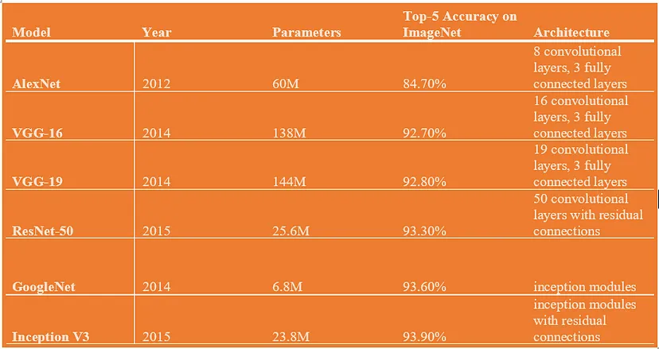

# Лабораторная работа №2: Детектирование объектов на изображении
### Задание:
Необходимо реализовать простейшую систему классификации изображений
на основе сверточных нейронных сетей. Возможно использовать любые
доступные технологии, рекомендованный список такой:
* Google Colab для запуска (можно другую платформу или локальную
машину)
* PyTorch
* Torchvision

Система должна загружать изображение с диска, преобразовывать в нужный
для обработки моделью нейронной сети формат (тензор), выполнять
предобработку, если требуется (например, изменение размера и
нормирование), затем обрабатывать с помощью нейронной сети и выводить
результат (номер класса, название, его вероятность для первых 5 наиболее
вероятных классов).

Необходимо провести исследование по сравнению эффективности трех
разных архитектур (можно использовать предобученные модели из
torchvision.models https://pytorch.org/vision/stable/models.html, например,
AlexNet, VGG16, ResNet50). Нужно узнать, на каком датасете предобучены
данные модели (использовать веса, полученные с одного и того же набора) и
найти список классов, которые они предсказывают.

Каждую модель необходимо протестировать на вашем собственном наборе
из не менее чем 50 изображений (можно использовать любые изображения,
но не те, которые использовались для обучения), в качестве метрик
использовать top-1 accuracy и top-5 accuracy.

В данной работе не требуется проводить обучение нейронной сети (только
по желанию).

## 1. Теоретическая база
Сверточные нейронные сети (CNN, Convolutional Neural Networks) являются основным инструментом для обработки изображений в современных системах машинного обучения. Основная идея состоит в том, чтобы извлекать из изображения пространственные особенности (features) с помощью сверточных слоев, которые применяют различные фильтры. CNN состоят из нескольких типов слоев:

* Сверточные слои (Convolutional Layers): выполняют свертку изображения с различными фильтрами для извлечения локальных особенностей.
* Слои подвыборки (Pooling Layers): уменьшают размерность данных, агрегируя информацию и уменьшая чувствительность к небольшим смещениям.
* Полносвязные слои (Fully Connected Layers): выполняют классификацию на основе извлеченных особенностей.

Популярные архитектуры CNN, такие как AlexNet, VGG16 и ResNet50, были разработаны для участия в соревнованиях по распознаванию изображений (например, ImageNet) и показали отличные результаты в классификации.

* В полностью связанных слоях AlexNet популяризировал новые на тот момент принципы использования функций активации ReLU , перекрывающегося пула и исключения. Его конструкция состоит из 8 сверточных слоев и 3 полносвязных слоев.
* VGGNet известен своей единообразной архитектурой, в которой используются крошечные (3x3) сверточные фильтры по всей сети. VGG16 состоит из 16 слоев (13 сверточных и 3 полносвязных).
* Архитектура ResNet представляет концепцию остаточного обучения, которая предполагает использование пропущенных соединений, позволяющих сети изучать остаточные функции. ResNet-50 включает в себя 50 слоев, при этом основным нововведением является вставка остаточных соединений для облегчения проблемы исчезающего градиента.

## 2. Описание разработанной системы
Система классификации изображений была реализована на Python с использованием библиотек PyTorch и Torchvision. 

### Алгоритмы и принципы работы
Основные этапы работы включают:
* Загрузку и предобработку изображений: изменяются их размеры и нормализуются для соответствия требованиям предобученной модели.
* Классификацию изображений, где они передаются через предобученные модели (AlexNet, VGG16, ResNet50), которые возвращают вероятности для каждого класса.
* Получение предсказаний и подсчет метрик для каждого изображения (номера классов, названия и вероятности для первых 5 наиболее вероятных классов). При этом номера классов при расчете метрик подменяются на ранее вычисленные соответствия между датасетами.

## 3. Результаты работы и тестирования системы
Для тестирования системы был использован собственный набор из 50 изображений из датасета COCO, которые не использовались для обучения моделей, так как модели AlexNet, VGG16 и ResNet50 из torchvision предобучены на датасете ImageNet. Для этого с помощью pycocotools были отобраны классы, имеющие явное соответствие и присутствующие в обоих датасетах. На основе этих классов были взяты изображения и их аннотации.

Результаты представлены в таблице:
|   Model  | Top-1 Accuracy | Top-5 Accuracy |
|----------|----------------|----------------|
| AlexNet  |      0.62      |      0.76      |
|  VGG16   |      0.74      |      0.86      |
| ResNet50 |      0.74      |      0.86      |

Использованные метрики:
* Top-1 Accuracy -- доля изображений, для которых топовое предсказание соответствует истинному классу.
* Top-5 Accuracy -- доля изображений, для которых истинный класс присутствует в топ-5 предсказаний.

## 4. Выводы по работе
* Хоть и считается, что ResNet50 за счет более глубокой архитектуры слоев и использованию остаточных блоков дает наиболее точные результаты классификации среди AlexNet и VGG16, однако на данном датасете результат такой же, как и у модели VGG16, которая имеет почти в 3 раза меньше слоев. 
* AlexNet показала хорошие результаты, но уступает более современным моделям по точности.

## 5. Использованные источники
1. Pytorch Documentation: https://pytorch.org/vision/stable/models.html
2. Torchvision Documentation: https://pytorch.org/vision/stable/index.html
3. Статья про сравнение моделей AlexNet, VGG-16, VGG-19, ResNet, GoogleNet https://medium.com/@muradatcorvit23/comparison-and-architecture-of-pre-trained-models-alexnet-vgg-16-vgg-19-resnet-googlenet-05f83214fc47
4. Статья про различия AlexNet, VGGNet, ResNet https://towardsdatascience.com/the-w3h-of-alexnet-vggnet-resnet-and-inception-7baaaecccc96
